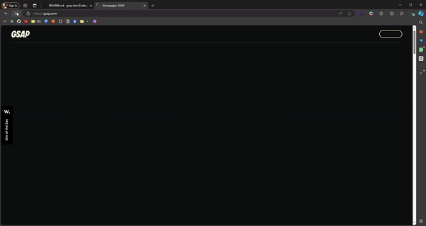
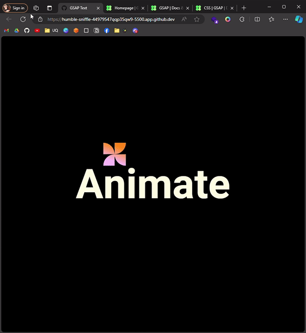

# Proyecto de Animación con GSAP

En este proyecto recreamos la animación de texto en [la página oficial de GSAP](https://gsap.com/), utilizando la misma biblioteca.

## Expectativa



## Realidad



## Conceptos Utilizados

En este proyecto se utilizan varios conceptos clave de GSAP:

[Timeline](https://gsap.com/docs/v3/GSAP/Timeline): Una secuencia de animaciones que pueden controlarse de forma conjunta.

```javascript
const tl = gsap.timeline();
```

[from](https://gsap.com/docs/v3/GSAP/Timeline/from): Define el estado inicial de la animación.

```javascript
tl.from(".a", { rotateX: -360, duration: 1 });
```

[to](<https://gsap.com/docs/v3/GSAP/Timeline/to()>): Define el estado final de la animación.

```javascript
tl.to("#circles", { scale: 1, duration: 1, ease: "elastic.out(1, 0.5)" });
```

[ease](https://gsap.com/docs/v3/Eases): Controla la velocidad de la animación, creando efectos más naturales.

```javascript
ease: "elastic.out(1, 0.5)";
```

[delay](https://gsap.com/resources/get-started/#delays): Retrasa el inicio de la animación.

```javascript
delay: 1;
```

[rotation](https://gsap.com/docs/v3/Plugins/Draggable/rotation/#details): Aplica una rotación al elemento.

También ver: [rotación direccional](https://gsap.com/resources/get-started/#delays)

```javascript
rotation: 360;
```

[repeat](https://gsap.com/resources/get-started/#repeats-and-alternating-repeats): Repite la animación un número específico de veces.

```javascript
// -1 para repetición infinita
repeat: -1;
```

[repeatDelay](<https://gsap.com/docs/v3/GSAP/Timeline/repeatDelay()/>): Define un retraso entre cada repetición de la animación.

```javascript
repeatDelay: 1;
```

## Otra documentación:

- [Cheatsheet](https://gsap.com/cheatsheet)
- [Staggers](https://gsap.com/resources/getting-started/Staggers/)
